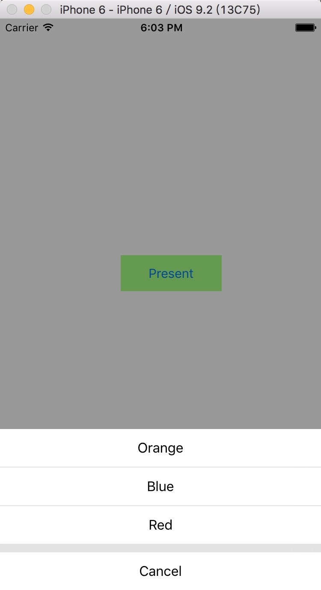
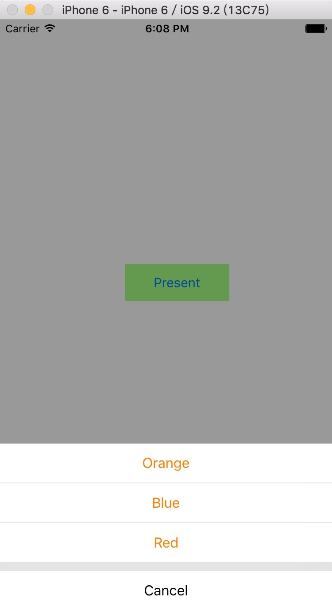

# HJPresentListView【PresentListView简单封装】


##导航

导入头文件

 ```Objective-C
#import "HJPresentListView.h"
 ```

遵循协议

 ```Objective-C
 @interface ViewController ()<HJPresentListViewDelegate>
 ```


实现协议方法：

仅一个必须实现的协议方法：

 ```Objective-C
- (void)PresentListView:(UIView *)presentListView clickedButtonAtIndex:(NSInteger)buttonIndex;
 ```
 
两个可供调用的方法

 ```Objective-C
- (void)show;
 ```
```Objective-C
- (void)showInView:(UIView *)view;
```
 
以下是两个颜色模式的截图，大家也可以修改源代码获得到大家想要的结果
 
 1、HJNormal
 


 1、HJOrange
 


（更多iOS开发干货，欢迎关注  [微博@3W_狮兄 ](http://weibo.com/hanjunzhao/) ）

----------
Posted by  [微博@3W_狮兄 ](http://weibo.com/hanjunzhao/))  
原创文章，版权声明：自由转载-非商用-非衍生-保持署名 | 

